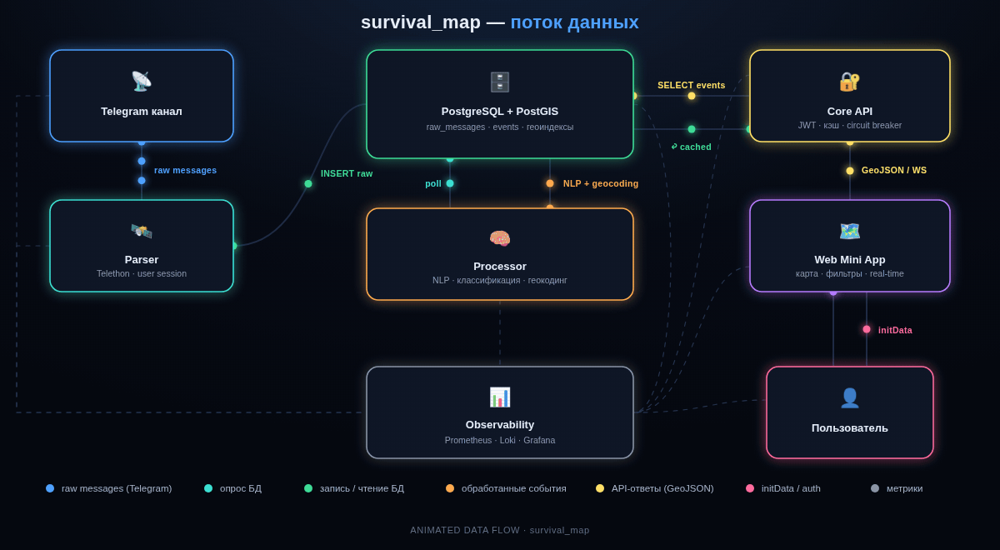
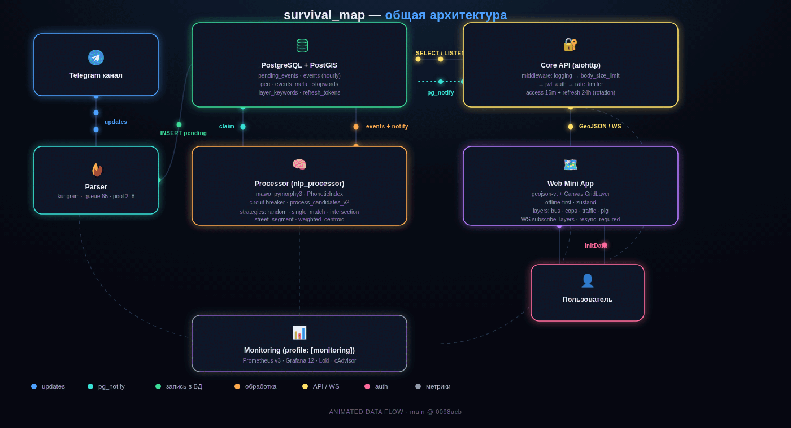
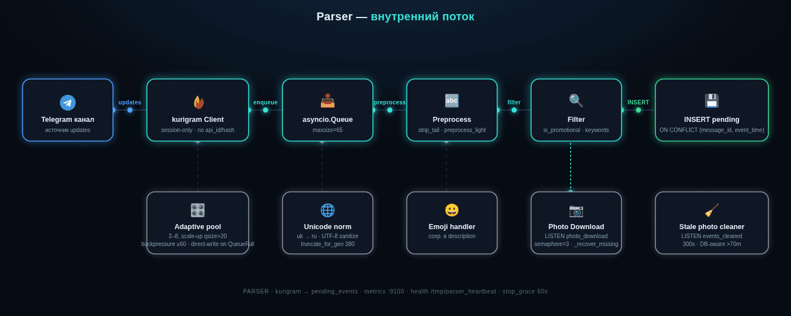
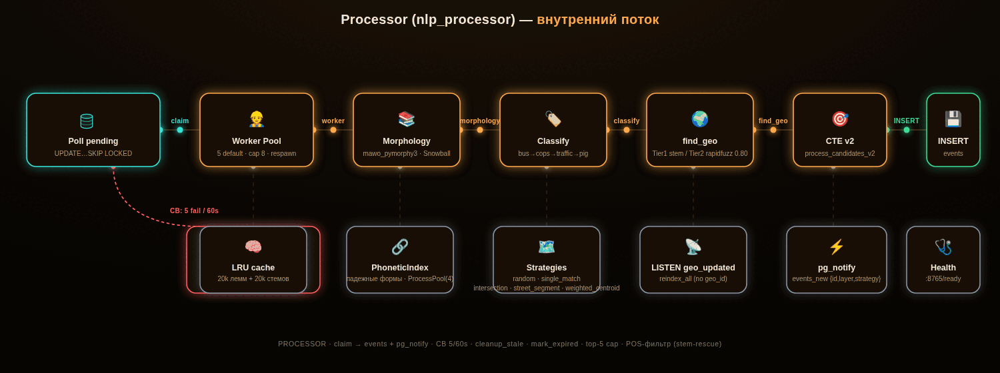
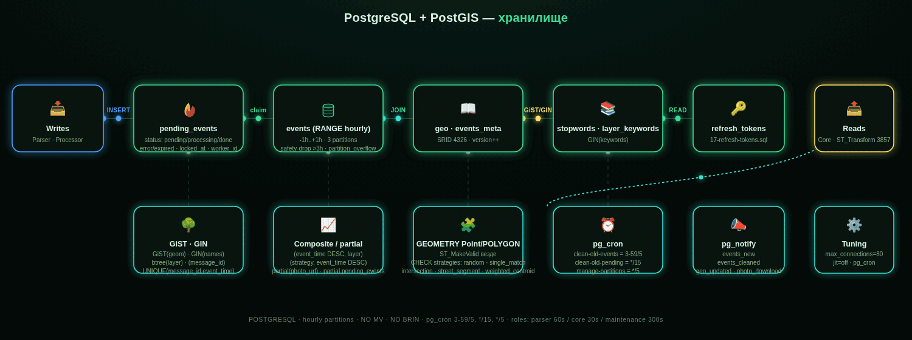
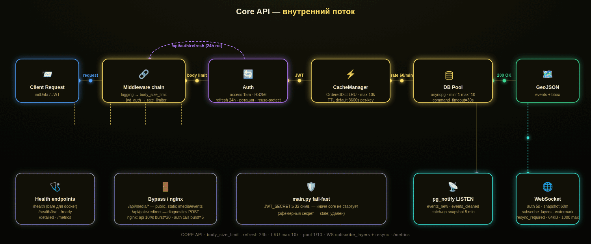
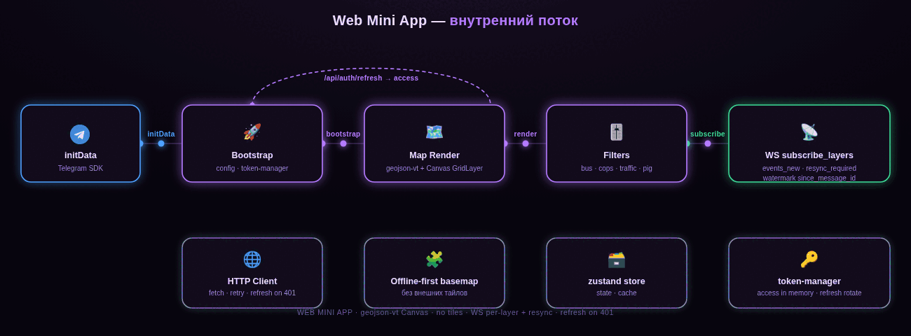

# Survival Map

Telegram Mini App — интерактивная карта событий Одессы (блокпосты, ТЦК, полиция,
транспорт). Парсер читает Telegram-канал и складывает сообщения в очередь;
процессор извлекает из них упоминания улиц, геолоцирует в PostGIS и в реальном
времени отдаёт на карту через WebSocket. Клиент показывает события за последние
60 минут и удаляет их сам (TTL).

<p align="center">
  
</p>

- **Извлечение улиц** — sliding-window матчер: морфология (`mawo-pymorphy3`) +
  fuzzy-сопоставление (`rapidfuzz`) против справочника гео-объектов (postgres/data/geo.csv). Без NER/нейросетей,
  CPU-only. Детали алгоритма — [docs/RULES_PARSER.md](docs/RULES_PARSER.md).
- **Карта** — PWA на Leaflet с векторной подложкой MapLibre GL (OpenFreeMap),
  offline-first. Детали — [docs/RULES_WEB.md](docs/RULES_WEB.md)

## Архитектура

Пять Docker-сервисов (`docker-compose.yml`):

| Сервис      | Назначение                                                        | Публичный порт |
|-------------|-------------------------------------------------------------------|----------------|
| `postgres`  | PostgreSQL + PostGIS: объекты (справочник), события с геометрией, очередь | —              |
| `parser`    | kurigram-клиент: канал → предобработка → `pending_events` (очередь)  | —              |
| `processor` | NLP-пайплайн: токенизация → лемматизация → классификация → geo → `events` | —              |
| `core`      | aiohttp: REST + WebSocket, JWT-валидация Telegram, `LISTEN events` | —              |
| `web`       | reverse-proxy + статика фронтенда (собирается в образе)            | **80**         |

<p align="center">
  
</p>

Сети изолированы: БД во внутренней сети (`internal: true`), наружу торчит только
web:80.

## Поток данных

```
Telegram-канал → parser → pending_events (очередь) → processor (NLP/geo)
   → PostgreSQL (PostGIS) → pg_notify → core (LISTEN → WebSocket) → web → карта
```

Каждый сервис занимает своё место в конвейере:

<p align="center">
  
  <br/><em>Parser — читает канал и складывает сообщения в очередь</em>
</p>

<p align="center">
  
  <br/><em>Processor — NLP-пайплайн: токенизация → лемматизация → классификация → геолокация</em>
</p>

<p align="center">
  
  <br/><em>PostgreSQL — хранение геометрии (PostGIS) + pg_notify для событий</em>
</p>

<p align="center">
  
  <br/><em>Core — REST + WebSocket, JWT-валидация Telegram</em>
</p>

<p align="center">
  
  <br/><em>Web Mini App — Leaflet-карта с событиями в реальном времени</em>
</p>

## Деплой

### 0. Требования

Хост — Linux или macOS с `bash` (Windows — через WSL2). Нужны:

- **Docker** + **Docker Compose v2** — рантайм всего стека.
- **Git** — клонирование репозитория.
- **Python 3.10+** с `pip` и `venv` на хосте — только для одноразовой генерации
  Telegram-сессии (шаг 2); в рантайме приложения не используется.
- **Telegram-аккаунт, подписанный на целевой канал.** Парсер читает канал под
  **пользовательской** сессией (не под ботом); без подписки Telegram не отдаст
  сообщения — и событий на карте не будет.
- **Бот от [@BotFather](https://t.me/BotFather)** (`BOT_TOKEN`) — **обязателен**: в
  сервисе `core` работает aiogram-бот, без валидного токена `core` не стартует.
- **Только для production Mini App:** публичный домен с **HTTPS** — Telegram
  открывает WebApp лишь по `https://` (см. раздел 5, вариант B).

> **sudo.** Если ваш пользователь не в группе `docker`, команды `docker …` ниже
> запускайте с `sudo` (`sudo docker compose …`). Либо один раз добавьте себя в
> группу и перелогиньтесь: `sudo usermod -aG docker $USER`.

### 1. Клонирование репозитория

```bash
git clone https://github.com/develop4alive/survival_map
cd survival_map
```

Все последующие команды выполняются **из корня проекта** (`survival_map/`).

### 2. Создание Telegram-сессии (один раз)

Парсер **не логинится в рантайме** — он ожидает готовый файл
`parser/session.session` и монтирует его volume'ом
(см. `_init_telegram_client` в [parser/monitoring.py](parser/monitoring.py)).
Делается **один раз**: пока сессия валидна, при обновлении или передеплое
приложения пересоздавать сессию не нужно. `api_id`/`api_hash` в кодовой базе не хранятся.

1. Получите `api_id` и `api_hash` на <https://my.telegram.org/apps>.
2. Создайте виртуальное окружение и установите клиент:

   ```bash
   python3 -m venv .venv
   source .venv/bin/activate
   pip install kurigram qrcode
   ```

3. Запустите готовый скрипт [scripts/gen_session.py](scripts/gen_session.py), передав
   `api_id`/`api_hash` аргументами:

   ```bash
   python scripts/gen_session.py <api_id> <api_hash>           # вход по QR (по умолчанию)
   ```

   Telegram → Настройки → Устройства → «Подключить устройство» → отсканируйте
   QR из терминала (если включена 2FA — введите пароль). Альтернатива — вход по
   телефону: добавьте флаг `--phone`.

4. Готово — скрипт сам сохраняет `parser/session.session` с правами `600`.
   Ручные `mv`/`chmod` не нужны.

5. Деактивируйте и удалите виртуальное окружение — для рантайма оно не нужно:

   ```bash
   deactivate
   rm -rf .venv
   ```

`api_id`/`api_hash` зашиваются внутрь `session.session` — в рантайме они больше
не нужны. Файл в `.gitignore` (`*.session`), в репозиторий не попадает.

> **Важно.** Авторизованный аккаунт должен быть **подписан на целевой канал**
> (`CHANNEL_ID` в [common/settings.py](common/settings.py)). Без подписки Telegram не
> отдаст историю и новые сообщения — парсер не увидит события. Подпишитесь этим
> аккаунтом на канал до запуска стека.

### 3. Конфигурация `.env`

```bash
cp .env.example .env   # шаблон в репозитории; секреты — только в .env (gitignored)
```

**Минимум для старта — вписать реальный `BOT_TOKEN`** (без валидного токена `core`
не поднимется). `env.example` содержит только секреты и per-deployment URL;
остальное захардкожено дефолтами в [common/settings.py](common/settings.py):

| Переменная                    | Обяз. | Описание                                            |
|-------------------------------|-------|-----------------------------------------------------|
| `BOT_TOKEN`                   | да    | токен бота от @BotFather; без него `core` (aiogram-бот) не стартует |
| `WEBAPP_URL`                  | для prod | публичный HTTPS-URL приложения; бот вставляет его в кнопку «Открыть приложение» и он же задаётся в @BotFather. Для локальной проверки не нужен |
| `TELEGRAM_WEBVIEW_VALIDATION` | нет   | Валидация Telegram initData/JWT. **Строгий парсинг (Secure by Default):** default `TRUE`; `'false'`/`'0'` — единственный триггер dev-bypass; любое другое/отсутствующее значение — `TRUE` |
| `REDIRECT_URL`                | нет   | куда отправлять не-Telegram трафик при включённой валидации |
| `JWT_SECRET`                  | да    | секрет подписи токенов, ≥32 символов; при отсутствии/плейсхолдере `core` не стартует (fail-fast, R-C8) |

Как именно открыть приложение (локально в браузере или как Telegram Mini App) —
см. раздел 5 ниже.

### 4. Запуск

```bash
docker compose up -d --build
```

Фронтенд собирается внутри `Dockerfile.web` (node-builder → `nginx:alpine`),
отдельный `npm run build` не нужен. Порядок готовности:
`postgres → parser/core → web`. Стек слушает `http://<host>:80/`, но как открыть
само приложение — см. раздел 5 (по умолчанию доступ только из Telegram).

Проверка, что стек поднялся:

```bash
docker compose ps                       # все сервисы healthy
curl -fsS http://localhost/health/ready # 200 OK
docker compose logs -f parser           # «Telegram client started», обработка сообщений
```

### 5. Открытие приложения: локально (dev) или как Mini App (prod)

Стек поднимается одинаково, но «увидеть карту» можно двумя путями. По умолчанию
API и WebSocket пускают **только трафик из Telegram** — в обычном браузере карта
будет пустой/редиректнет.

#### Вариант A — локальная проверка в браузере (dev)

1. В `.env`: `TELEGRAM_WEBVIEW_VALIDATION=false`.
2. `docker compose up -d --build` (или `docker compose restart core`, если стек уже запущен).
3. Откройте <http://localhost/> на той же машине — карта с событиями.

> ⚠️ В этом режиме авторизация выключена — это **только для локальной отладки**.
> Не выставляйте такой стек в интернет.

#### Вариант B — публичный Telegram Mini App (production)

Telegram открывает WebApp только по HTTPS, а контейнер `web` отдаёт HTTP на `:80` —
поэтому перед ним нужен HTTPS-фронт.

1. **Поднимите HTTPS к `web:80`.** Без своего домена/проброса портов проще всего —
   [Cloudflare Tunnel](https://developers.cloudflare.com/cloudflare-one/connections/connect-networks/)
   (`cloudflared`, бесплатно, выдаёт адрес `https://…`). Классика со своим доменом —
   reverse-proxy с авто-TLS ([Caddy](https://caddyserver.com/) или nginx + certbot),
   проксирующий на `web:80`.
2. В `.env`: `TELEGRAM_WEBVIEW_VALIDATION=true` (дефолт) и `WEBAPP_URL=https://<ваш-домен>`.
3. Перезапустите: `docker compose up -d --build`.
4. В [@BotFather](https://t.me/BotFather): `/mybots` → ваш бот → **Bot Settings →
   Configure Mini App** → укажите URL `https://<ваш-домен>` (по желанию — тот же URL
   на **Menu Button**).
5. Откройте бота в Telegram, отправьте `/start` → кнопка «🌐 Открыть приложение»
   запустит карту. `initData` проверяется по `BOT_TOKEN`.

### Остановка

```bash
docker compose down        # все сервисы завершаются корректно (exit 0)
docker compose down -v     # + удалить тома (БД, медиа)
```

### Мониторинг: Prometheus + Grafana (профиль monitoring)

Метрики собираются со всех ключевых сервисов и отображаются в Grafana:

| Job | Цель | Что видно |
|---|---|---|
| `core` | `core:8080/metrics` | HTTP rate/latency (http_*), WebSocket (ws_*), процесс |
| `parser` | `parser:9100/metrics` | messages_*, очередь (0..65), backpressure |
| `nlp_processor` | `nlp_processor:8765/metrics` | messages_*, воркеры, circuit breaker |
| `postgres` | `postgres_exporter:9187` | pg_stat_database, locks, WAL, vacuum |
| `cadvisor` | `cadvisor:8080` | CPU/RAM/сеть/disk каждого контейнера |

Запуск:

```bash
docker compose --profile monitoring up -d
# Grafana:   http://localhost:3000  (admin / GRAFANA_ADMIN_PASSWORD из .env)
# Prometheus: http://localhost:9090
```

Порты 3000/9090 публикуются только на `127.0.0.1` — наружу телеметрия не
торчит (доступ с другой машины: `ssh -L 3000:localhost:3000 -L 9090:localhost:9090 <host>`).
Пароль Grafana задавайте через `GRAFANA_ADMIN_PASSWORD` в `.env` (дефолт `admin`).

Автоматически провижинятся datasource (Prometheus, Loki) и три дашборда
(папка "Survival Map"): **Overview** — health сервисов, конвейер
parser→processor, HTTP core, TPS/кэш PostgreSQL; **Containers** — CPU/RAM/сеть/disk
по контейнерам (cAdvisor); **Logs** — объём логов, ошибки, живой поток (Loki:
лейбл `service` — имя compose-сервиса, ошибки фильтруются по `detected_level`).
Логи контейнеров собирает promtail через docker.sock.

Ключевые метрики конвейера: `parser_queue_size` (рост к 60/65 = backpressure),
`processor_messages_errors_total` (перманентные ошибки NLP),
`processor_circuit_breaker_state > 0` (деградация БД),
`rate(processor_messages_processed_total[5m])` (события/сек).

Приложение-метрики экспортируются сервисами напрямую (без авторизации —
порты доступны только внутри docker-сети: expose, не ports).

## Структура репозитория

```
core/        backend сервиса `core` (aiohttp app, API, БД-адаптеры, settings)
parser/      сервис `parser` (kurigram: канал → очередь pending_events)
processor/   сервис `processor` (NLP: токенизация → лемматизация → geo → events)
postgres/    init-скрипты схемы и данные (geo.csv, stopwords.csv)
web/         фронтенд сервиса `web` (TypeScript + Leaflet/MapLibre, webpack)
docs/        правила микросервисов (RULES_*.md)
```

## Документация

По документу на каждый микросервис:

- [docs/RULES_CORE.md](docs/RULES_CORE.md) — backend: REST + WebSocket API, JWT/Telegram, middleware, БД-адаптеры
- [docs/RULES_PARSER.md](docs/RULES_PARSER.md) — алгоритм парсера (канал → очередь)
- [docs/RULES_PROCESSOR.md](docs/RULES_PROCESSOR.md) — NLP-пайплайн (sliding-window, тиры матча, стратегии геометрии)
- [docs/RULES_WEB.md](docs/RULES_WEB.md) — фронтенд + nginx (PWA, Leaflet/MapLibre, reverse-proxy)
- [docs/RULES_POSTGRES.md](docs/RULES_POSTGRES.md) — схема PostGIS, справочник, TTL событий

Поддержать разработчиков монетой здесь:
 https://bastyon.com/keep_alive_odessa?ref=PHQHKADhBPxxSwjiggV6G2BxSvy6TY1Lgb